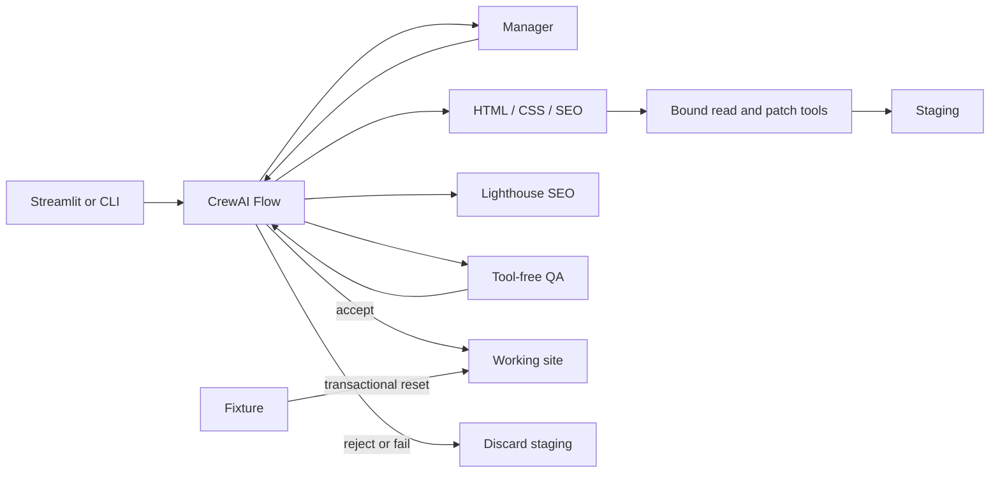

# AgentOrchestra

AgentOrchestra is a local multi-agent webpage editor for the committed static sample site. It routes natural-language requests to HTML, CSS, and SEO specialists, validates staged changes with a tool-free QA agent, and promotes only accepted work.

> **Manager decides what should run. Flow decides what actually runs.**

## Capabilities

- Manager routing with measurable assignments and acceptance criteria.
- HTML, CSS, and SEO ownership boundaries plus read-only SEO diagnosis.
- Workspace-bound reads and exact patches against an isolated staged copy.
- Applied/rejected patch evidence, deterministic diffs, and site-tree digests.
- Lighthouse SEO-only evidence for SEO work.
- Tool-free QA with criterion-level accept/reject evidence.
- CrewAI Flow transitions, transactional promotion, verified rollback, and reset.
- Playwright `Before` and proposed/accepted screenshots at one desktop viewport.
- Streamlit routing, timeline, evidence, metrics, and outcome views.

Screenshots are presentation-only artifacts; screenshots do not influence QA.

## Safety model

Agents cannot select arbitrary projects or write `sites/working` or `sites/fixture`. Trusted code binds each specialist to an allowlisted staged workspace and exact-patch tools. The Flow validates evidence and content digests, runs QA, and alone may promote staging. Rejected or failed staging is discarded. A failed promotion is rolled back and verified; an unverified rollback is surfaced as critical recovery rather than hidden.

## Architecture



See [Architecture](docs/architecture.md) for the complete component, sequence, ownership, evidence, file-lifecycle, and Flow-transition diagrams.

## Requirements

- Python `>=3.11,<3.14`; development and final verification use Python 3.12.
- [uv](https://docs.astral.sh/uv/) and the committed `uv.lock`.
- Node.js and npm with the committed `package-lock.json`.
- Playwright Chromium for screenshots. Docker also reuses that browser for Lighthouse;
  local Lighthouse runs require a discoverable Chrome/Chromium executable.
- One Groq key/model pair for each live role: Manager, HTML, CSS, SEO, and QA.

The final workflow has been exercised on Windows. Linux and macOS commands are documented where portable, but those platforms are not claimed as tested.

## Quick start

```bash
git clone <repository-url>
cd agentorchestra
uv sync --frozen
npm ci
uv run playwright install chromium
```

Copy `.env.example` to `.env`, replace placeholders, then verify and launch:

```bash
uv run python scripts/run_demo.py --check
uv run python scripts/reset_demo_site.py --reset
uv run python scripts/run_ui.py
```

On PowerShell, copy the environment template with `Copy-Item .env.example .env`.

## Docker

Build the image from the repository root:

```bash
docker build -t agentorchestra -f Dockerfile .
```

Run the Streamlit UI on port `8501`:

```bash
docker compose up --build app
```

Run the isolated clean-install verifier inside the image:

```bash
docker compose --profile verify run --rm verify
```

The container expects the same `agentorchestra/.env` file you would use locally.

## Environment variables

| Role or setting | Variables |
|---|---|
| Manager | `GROQ_MANAGER_API_KEY`, `GROQ_MANAGER_MODEL` |
| HTML | `GROQ_HTML_API_KEY`, `GROQ_HTML_MODEL` |
| CSS | `GROQ_CSS_API_KEY`, `GROQ_CSS_MODEL` |
| SEO | `GROQ_SEO_API_KEY`, `GROQ_SEO_MODEL` |
| QA | `GROQ_QA_API_KEY`, `GROQ_QA_MODEL` |
| Application | `APP_ENV`, `LOG_LEVEL` |
| Optional root override | `AGENTORCHESTRA_ROOT` |

Keys may come from separately authorized Groq organizations. Never commit `.env`. Imports, offline checks, and automated tests do not require real credentials.

## Running the project

```bash
# Streamlit
uv run python scripts/run_ui.py

# Full QA-controlled edit (live calls; may promote working)
uv run python scripts/run_edit_flow.py --target-page index.html --instruction "Change the Start a project button to red." --apply

# One staging-only specialist preview
uv run python scripts/run_specialist.py --specialist css --target-page index.html --task "Make the home page hero section shorter."

# Read-only SEO diagnosis through the full Flow
uv run python scripts/run_edit_flow.py --target-page index.html --instruction "Diagnose this page's source SEO without editing it." --apply

# Lighthouse-only working-site audit (no Groq, no mutation)
uv run python scripts/run_lighthouse_seo.py --target-page index.html --apply

# Screenshot-only working-site capture
uv run python scripts/capture_page_screenshot.py --target-page index.html --apply

# Transactional reset
uv run python scripts/reset_demo_site.py --reset
```

See [Usage](docs/usage.md) for workflows, outcomes, examples, and metrics.

## Testing and reproducibility

```bash
uv run python -m pytest -q
uv run ruff check .
git diff --check
uv run python scripts/verify_clean_install.py --check
```

Focused example: `uv run python -m pytest tests/test_flow_transitions.py -q`. Full isolated installation is explicit and may use the network: `uv run python scripts/verify_clean_install.py --full --apply`.

## Generated files

Runtime staging is under `sites/staging/`; raw Lighthouse reports, screenshots, and routing reports are under `reports/`. Promotion/reset candidates and backups use `.agentorchestra-*-candidate-*` and `.agentorchestra-*-backup-*` names. A persistent, ignored `.agentorchestra-working-site.lock` serializes staged snapshots, promotion, rollback, and reset across UI sessions and processes. Generated contents are ignored while tracked `.gitkeep` files retain required directories. Recovery directories from a critical rollback must not be deleted blindly.

## Limitations

- The committed fixed sample site only; no arbitrary uploads or live-site editing.
- Static HTML, one shared plain CSS file, and narrow SEO work only.
- Semantic CSS edits are limited to targets and operations in the fixed component catalog.
- No JavaScript, backend, framework, Accessibility Agent, or Content Agent.
- Lighthouse SEO category only; screenshots do not influence QA.
- One desktop screenshot viewport; no pixel-diff scoring.
- No persistent run history, database, authentication, or multi-user support.
- Live execution depends on Groq, Chrome/Chromium, Playwright, and Lighthouse availability.

## Documentation

- [Setup](docs/setup.md)
- [Usage](docs/usage.md)
- [Architecture](docs/architecture.md)
- [Demo](docs/demo.md)
- [Troubleshooting](docs/troubleshooting.md)
