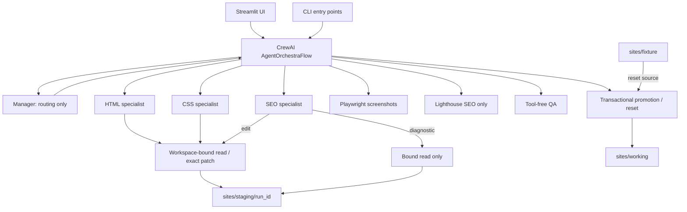
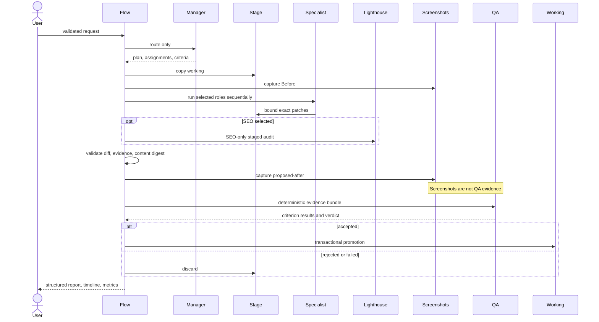
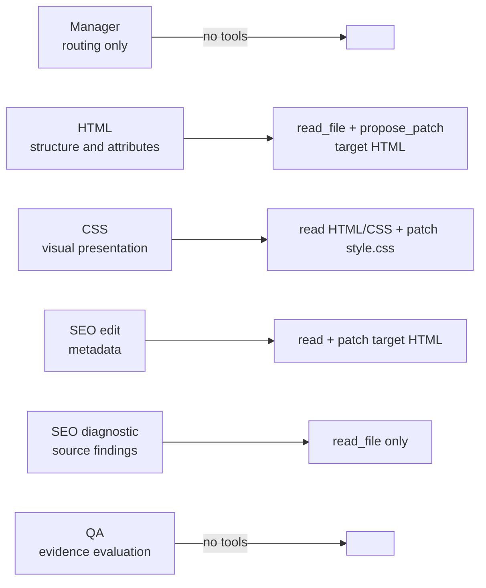
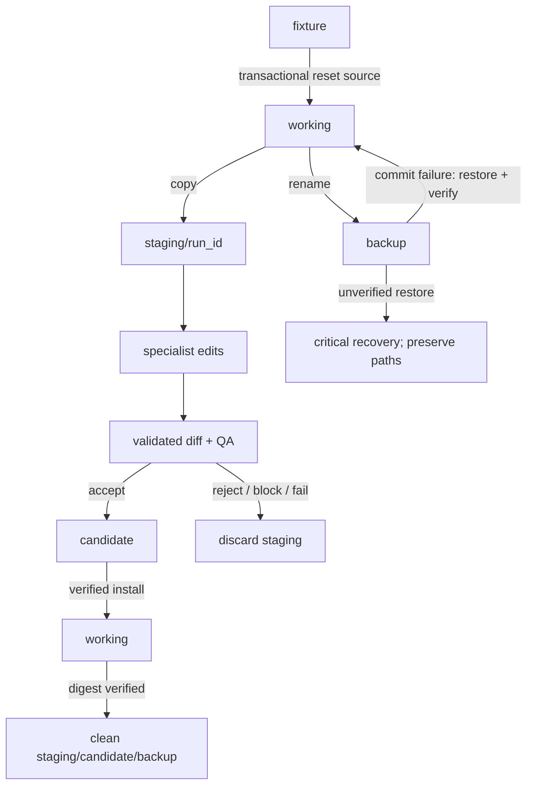
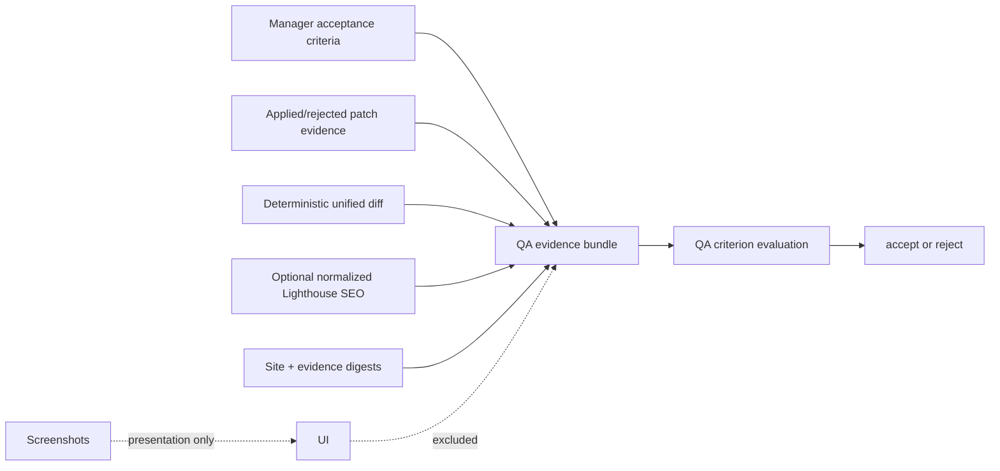
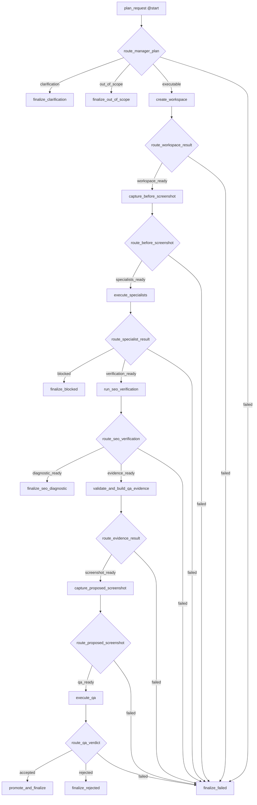

# Architecture

The governing rule is: **Manager decides what should run. Flow decides what actually runs.** Models propose plans or patches; trusted application services own execution and promotion.

## Components

## Edit lifecycle

SEO diagnostic mode branches after Lighthouse: it returns findings, skips proposed screenshot/QA/promotion, cleans staging, and leaves working unchanged.

## Agent ownership and tools

All agents use `allow_delegation=False`. Manager never reads files or invokes specialists. QA is never a selectable specialist.

## File lifecycle

Candidate and backup paths are server-generated and constrained to the application root. Digest equality complements exact diff equality.

## Evidence model

QA receives normalized evidence, not raw provider responses or raw Lighthouse JSON. An SEO score cannot prove unrelated HTML/CSS criteria or ranking improvement.

## Actual Flow transitions

Screenshot failures normally become warnings and the transition continues; safety failures can stop execution.

## Security boundaries

- Trusted code creates workspace handles, hides specialist identity, and binds allowed files.
- A deterministic patch policy rejects active scripting, cross-owned HTML/SEO/presentation
  changes, and CSS imports or active/external URL references before staged bytes are replaced.
- LLM-visible tool arguments contain only validated relative file names, bounded ranges, and exact replacement text.
- Absolute paths, traversal, unsupported extensions, structure drift, assets changes, and symlinks are rejected.
- Manager, specialist, and QA keys/models are resolved independently with no role fallback.
- Preview and screenshot networking is loopback-only; agents receive no shell or browser tool.
- Promotion revalidates the reviewed diff, evidence digest, and content digest immediately before replacement.

## Failure behavior

- Zero-match, multiple-match, no-op, unauthorized, or oversized patches are rejected with deterministic evidence.
- A blocked/failed specialist stops later specialists and discards staging.
- Lighthouse failure stops SEO verification without crashing the UI.
- A normal screenshot failure is a warning; screenshots never decide QA.
- QA rejection discards staging and preserves working.
- Promotion failure restores and verifies the original working tree.
- An unverified rollback raises critical recovery and preserves named recovery material.
- A successful commit with cleanup failure remains accepted with explicit cleanup warnings.
